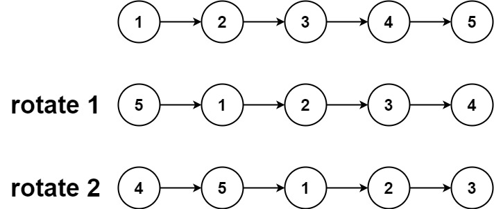

## Problem

Given the head of a linked list, rotate the list to the right by k places




## Solution

Note that k can be greater than the length of list. In that we go around again to original and rotate again.

So we need the length of the list, get it by iterating.

k = k % 10

Because rotating length times will give you the same exact array. If k=0, return the same array

Else, find the nth node from behind. this is the length-k-1 node, since we already know the length

split the lists into two, then connect second list + first list


## Code

```python
# Definition for singly-linked list.
# class ListNode:
#     def __init__(self, val=0, next=None):
#         self.val = val
#         self.next = next
class Solution:
    def rotateRight(self, head: Optional[ListNode], k: int) -> Optional[ListNode]:
        if not head:
            return head
        length,tail=1,head
        cur=head
        while tail.next:
            tail=tail.next
            length+=1
        k=k%length
        if k==0:
            return head
        for i in range(length-k-1):
            cur=cur.next
        new=cur.next
        cur.next=None
        tail.next=head
        return new
```